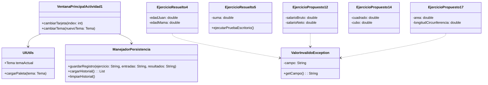
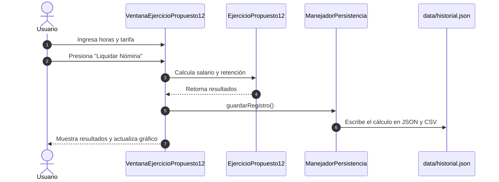

# Actividad 1 - Programación Orientada a Objetos (UNAL)

Repositorio de la primera entrega de la asignatura **Programación Orientada a Objetos** en la Universidad Nacional de Colombia.

* **Docente:** Walter Hugo Arboleda
* **Estudiante:** Cristian Ruiz Hernandez
* **Correo:** cruizh@unal.edu.co
* **Repositorio en GitHub:** https://github.com/cioranemil/trabajo-1

---

## De qué trata esta actividad

Esta entrega reune los 5 ejercicios de lógica y algoritmos del libro de Efraín Oviedo pedidos para la primera actividad del curso. Para presentar los resultados de forma ordenada y fácil de probar, construí una interfaz gráfica interactiva en Java Swing que integra todos los ejercicios en un solo menú con navegación lateral, gráficos interactivos, persistencia de datos y control de errores.

---

## Ejercicios incluidos

| Número | Tipo | Nombre del Ejercicio | Descripción corta | Clase principal |
| :-: | :--- | :--- | :--- | :--- |
| **1** | Resuelto 4 | Edades de la familia | Calcula las edades de Juan, Alberto (2/3), Ana (4/3) y la mamá (suma de las tres). | `EjercicioResuelto4.java` |
| **2** | Resuelto 5 | Prueba de escritorio | Hace el seguimiento de variables (X, Y, SUMA) paso a paso con una tabla interactiva. | `EjercicioResuelto5.java` |
| **3** | Propuesto 12 | Salarios y retención | Calcula salario bruto, retención en la fuente y salario neto de un empleado. | `EjercicioPropuesto12.java` |
| **4** | Propuesto 14 | Cuadrado y cubo | Dado un número, obtiene su cuadrado (n²), cubo (n³) y su representación gráfica. | `EjercicioPropuesto14.java` |
| **5** | Propuesto 17 | Geometría del círculo | Calcula el área (πr²), la longitud (2πr) y el diámetro (2r) con un canvas a escala. | `EjercicioPropuesto17.java` |

---

## Características de la aplicación

- **Interfaz unificada en Swing:** Todo se maneja desde una misma ventana principal con barra lateral para cambiar entre ejercicios sin abrir ventanas emergentes.
- **Temas de color:** Permite cambiar en tiempo real entre cuatro temas de color (Catppuccin Oscuro, Catppuccin Claro, Dracula y Nord).
- **Gráficos en Java2D:** El ejercicio del círculo dibuja la figura a escala según el radio ingresado y el ejercicio de nómina dibuja un gráfico de barras comparativo del salario.
- **Persistencia de datos:** Los datos de cada cálculo que se realiza se guardan automáticamente en disco en la carpeta `data/` en formatos `historial.json` y `historial.csv`, y se pueden consultar o limpiar desde la opción "Historial" en el menú.
- **Manejo de excepciones:** Se implementó la clase `ValorInvalidoException` para validar las entradas (evitar texto donde van números, edades fuera de rango o números negativos en geometría) mostrando alertas claras sin que el programa colapse.

---

## Diagramas UML

### Diagrama de Clases



### Diagrama de Secuencia (Guardado de datos)



---

## Cómo ejecutar el proyecto

### Opción 1: En Windows usando el script `.bat`
Doble clic en el archivo `ejecutar.bat` en la raíz del proyecto.

### Opción 2: Ejecutar desde la consola
```bash
# Compilar los archivos Java
javac -encoding UTF-8 -d bin src/*.java src/**/*.java

# Generar el ejecutable JAR
jar cfe Actividad_1.jar MenuPrincipal -C bin .

# Correr la aplicación
java -jar Actividad_1.jar
```
