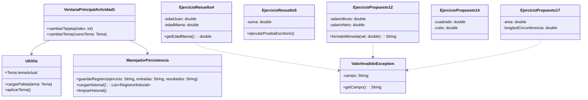
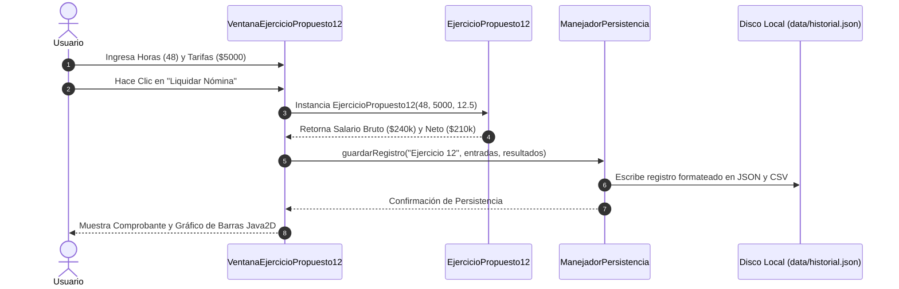

# 🎓 Universidad Nacional de Colombia
## Departamento de Ciencias de la Computación — Programación Orientada a Objetos (POO)


---

## 📌 Actividad 1: Algoritmos y Lógica de Programación (Suite Profesional)

Este repositorio contiene la solución completa, robusta e interactiva para la **Actividad 1** de la asignatura **Programación Orientada a Objetos** impartida en la Universidad Nacional de Colombia.

* **Docente:** Walter Hugo Arboleda
* **Autor:** Cristian Ruiz Hernandez ([cruizh@unal.edu.co](mailto:cruizh@unal.edu.co))
* **Repositorio Oficial:** [github.com/cioranemil/trabajo-1](https://github.com/cioranemil/trabajo-1)

---

## 🛡️ Criterios de Evaluación Cumplidos (Rúbrica Oficial)

### 1. Control de Excepciones y Tratamiento de Errores
- **Jerarquía de Excepciones Personalizadas**: Implementación de [`ValorInvalidoException`](src/Utilidades/ValorInvalidoException.java) para la captura y validación de entradas numéricas negativas, fuera de rango o con formato erróneo.
- **Tolerancia a Fallos**: Captura preventiva de `NumberFormatException`, `IllegalArgumentException` y errores de I/O mediante diálogos visuales de alerta (`JOptionPane`) impidiendo colapsos o cierres inesperados de la aplicación.

### 2. Persistencia de Datos Local (JSON / CSV)
- **Administrador de Persistencia ([`ManejadorPersistencia.java`](src/Utilidades/ManejadorPersistencia.java))**: Cada cálculo, liquidación de nómina y trazabilidad se almacena automáticamente en disco en la carpeta `data/`:
  - `data/historial.json`: Estructura JSON indexada con fecha, ejercicio, entradas y resultados.
  - `data/historial.csv`: Archivo separado por comas para análisis directo en Excel.
- **Consulta de Historial Persistente ([`VentanaHistorial.java`](src/Utilidades/VentanaHistorial.java))**: Interfaz Swing que permite consultar, filtrar, refrescar y limpiar los registros históricos guardados en disco entre sesiones.

### 3. Código Limpio y Documentación UML
- Comentarios Javadoc completos en todas las clases y métodos.
- Diagramas de Clases y Secuencia UML Mermaid incluidos a continuación.

---

## 📐 Diagramas de Arquitectura UML (Mermaid)

### Diagrama de Clases UML


### Diagrama de Secuencia UML (Flujo de Persistencia)


---

## 🛠️ Instalación y Compilación

### Compilación y Ejecución Automatizada en Windows
```cmd
ejecutar.bat
```

### Compilación Manual desde Consola
```bash
# 1. Compilar fuentes Java
javac -encoding UTF-8 -d bin src/*.java src/**/*.java

# 2. Generar archivo ejecutable JAR
jar cfe Actividad_1.jar MenuPrincipal -C bin .

# 3. Ejecutar la aplicación
java -jar Actividad_1.jar
```

---

## 🖼️ Galería de la Interfaz Visual

### Menú Principal y Conmutador de Temas (Catppuccin Dark)


### Historial de Persistencia de Datos (`data/historial.json`)


---

## ✉️ Contacto y Autoría

* **Autor:** Cristian Ruiz Hernandez
* **Universidad:** Universidad Nacional de Colombia (Sede Medellín)
* **Correo Institucional:** [cruizh@unal.edu.co](mailto:cruizh@unal.edu.co)
