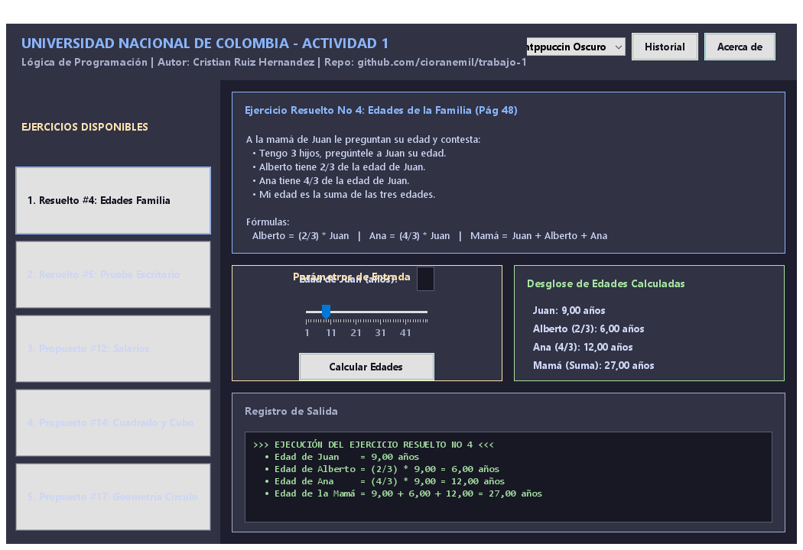
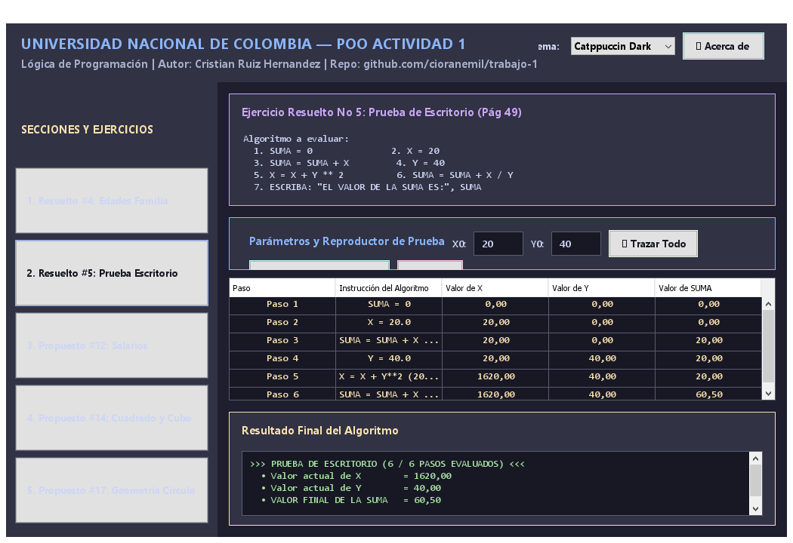
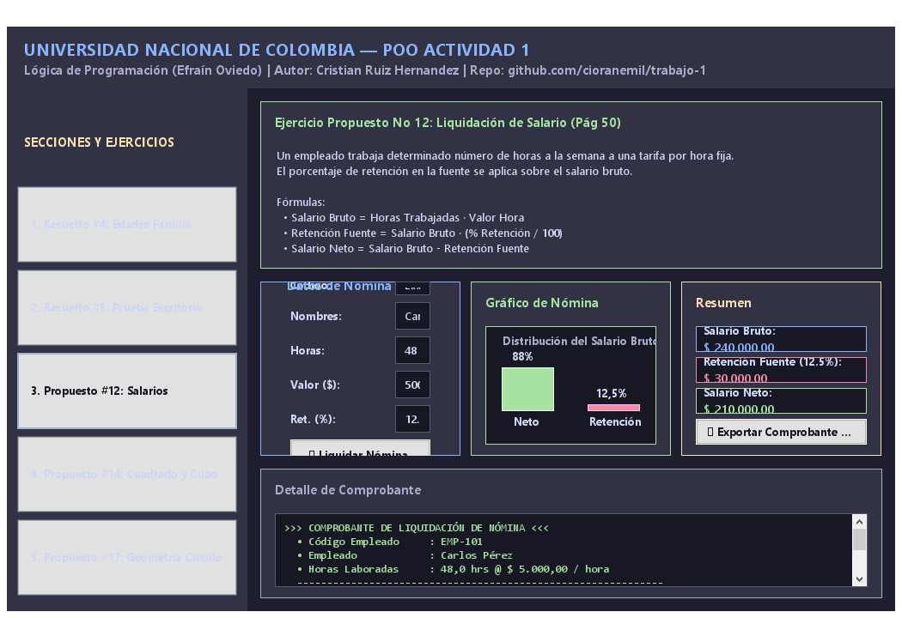
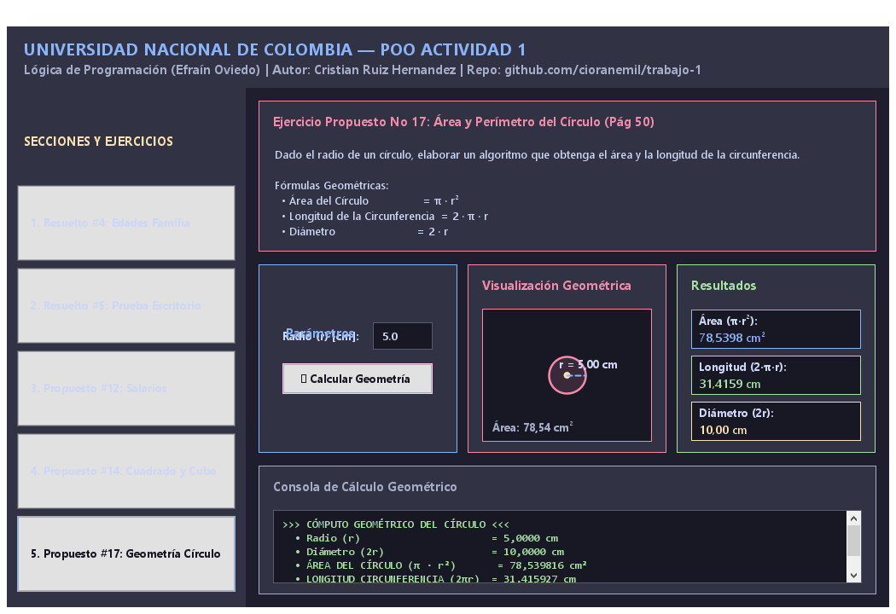

# 🎓 Universidad Nacional de Colombia
## Departamento de Ciencias de la Computación — Programación Orientada a Objetos (POO)


---

## 📌 Actividad 1: Algoritmos y Lógica de Programación

Este repositorio contiene la solución completa, profesionalizada e interactiva para la **Actividad 1** de la asignatura **Programación Orientada a Objetos** impartida en la Universidad Nacional de Colombia.

* **Docente:** Walter Hugo Arboleda
* **Autor:** Cristian Ruiz Hernandez ([cruizh@unal.edu.co](mailto:cruizh@unal.edu.co))
* **Repositorio Oficial:** [github.com/cioranemil/trabajo-1](https://github.com/cioranemil/trabajo-1)

---

## 🚀 Características Principales del Proyecto

- **🖥️ Interfaz Gráfica Unificada (Swing GUI)**:
  - Diseño moderno basado en la paleta cromática de alto contraste **Catppuccin Macchiato/Mocha**.
  - Panel lateral de navegación (**Sidebar**) que permite explorar los 5 ejercicios sin abrir ventanas emergentes.
  - Resultados interactivos en tiempo real con validaciones de entrada.
- **🎨 Visualizaciones Gráficas Interactivas (Java2D)**:
  - **Cómputo Geométrico (Ejercicio 17)**: Canvas gráfico que renderiza el círculo a escala en tiempo real con sus cotas de radio y diámetro.
  - **Gráfico de Nómina (Ejercicio 12)**: Visualización en diagrama de barras de la distribución del Salario Bruto vs. Retención en la Fuente y Salario Neto.
  - **Prueba de Escritorio (Ejercicio 5)**: Tabla dinámica interactiva que realiza el seguimiento instruccional paso a paso.
- **📄 Módulo de Exportación**:
  - Generación de comprobantes oficiales de nómina en formato `.txt` con membrete institucional.
- **📚 Documentación Académica en LaTeX (`main.pdf`)**:
  - Informe técnico de 8 páginas compilado con TeX Live 2026, incluyendo diagramas UML TikZ, casos de uso e hipervínculos activos.

---

## 📂 Estructura de Ejercicios del Libro (Efraín Oviedo)

| # | Tipo | Ejercicio | Tema Principal | Componente Java |
| :-: | :--- | :--- | :--- | :--- |
| **1** | Resuelto No 4 | *Edades de la Familia* | Relaciones algebraicas en POO | [`EjercicioResuelto4.java`](src/ejercicio_resuelto_4/EjercicioResuelto4.java) |
| **2** | Resuelto No 5 | *Prueba de Escritorio* | Trazabilidad de variables y expresiones | [`EjercicioResuelto5.java`](src/ejercicio_resuelto_5/EjercicioResuelto5.java) |
| **3** | Propuesto No 12 | *Liquidación de Salarios* | Deducciones de nómina y porcentajes | [`EjercicioPropuesto12.java`](src/ejercicio_propuesto_12/EjercicioPropuesto12.java) |
| **4** | Propuesto No 14 | *Cuadrado y Cubo* | Potenciación y exponenciación | [`EjercicioPropuesto14.java`](src/ejercicio_propuesto_14/EjercicioPropuesto14.java) |
| **5** | Propuesto No 17 | *Geometría del Círculo* | Geometría euclidiana y constante $\pi$ | [`EjercicioPropuesto17.java`](src/ejercicio_propuesto_17/EjercicioPropuesto17.java) |

---

## 📐 Arquitectura de Software (Patrón MVC / POO)

El proyecto sigue una separación clara de responsabilidades:
- **`Model (Dominio)`**: Clases de cálculo pura encubiertas en paquetes individuales (`ejercicio_resuelto_4`, `ejercicio_resuelto_5`, etc.) sin acoplamiento a Swing.
- **`View (UI Swing)`**: Componentes Swing estilizados ([`UIUtils.java`](src/Utilidades/UIUtils.java)) e integrados en [`VentanaPrincipalActividad1.java`](src/MenuPrincipal/VentanaPrincipalActividad1.java).
- **`Controller (Interacción)`**: Eventos de cambio en tiempo real (`DocumentListener`, `ChangeListener`, `ActionListener`).

---

## 🛠️ Instalación y Compilación

### Requisitos Previos
- Java Development Kit (JDK 17 o superior, recomendado OpenJDK 25).
- TeX Live (opcional, para recompilar `main.tex`).

### Ejecución Directa en Windows (CMD / PowerShell)
Simplemente ejecuta el script automatizado:
```cmd
ejecutar.bat
```

### Compilación Manual desde Consola
```bash
# 1. Compilar fuentes Java
javac -encoding UTF-8 -d bin src/*.java src/**/*.java

# 2. Generar archivo ejecutable JAR
jar cfe Actividad_1.jar MenuPrincipal -C bin .

# 3. Ejecutar la aplicación
java -jar Actividad_1.jar
```

---

## 🖼️ Galería de la Interfaz Visual

### Menú Principal y Ejercicio 4 (Edades)


### Ejercicio 5 (Prueba de Escritorio con Trazabilidad)


### Ejercicio 12 (Nómina con Gráfico de Barras Java2D)


### Ejercicio 17 (Geometría del Círculo con Canvas Java2D)


---

## ✉️ Contacto y Autoría

* **Autor:** Cristian Ruiz Hernandez
* **Universidad:** Universidad Nacional de Colombia (Sede Medellín)
* **Correo Institucional:** [cruizh@unal.edu.co](mailto:cruizh@unal.edu.co)
